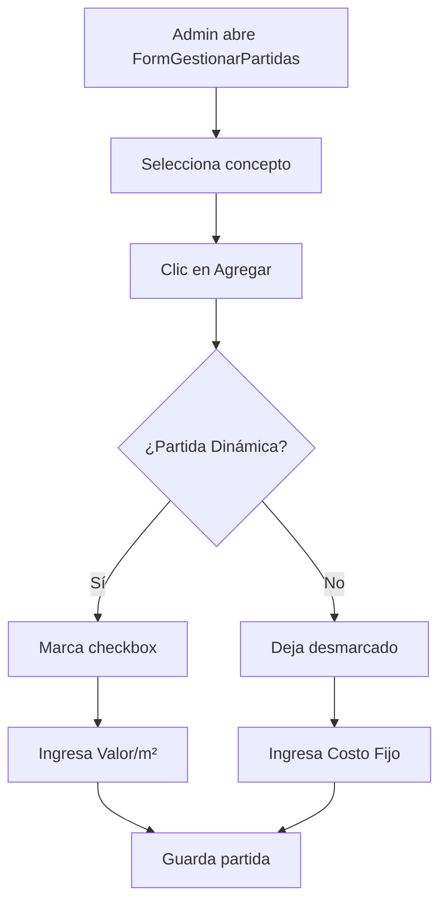
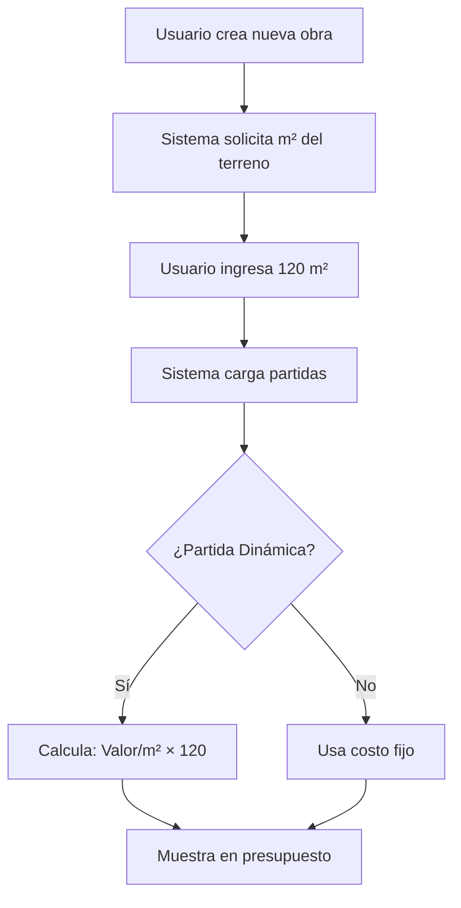

# ?? IMPLEMENTACIÓN: PRESUPUESTO DINÁMICO POR M²

## ?? Objetivo

Permitir que algunas partidas tengan un **costo dinámico** calculado automáticamente en base a los **metros cuadrados (m²)** del proyecto, en lugar de un costo fijo tradicional.

---

## ?? Características Principales

### ? Dos Tipos de Partidas

| Tipo | Descripción | Ejemplo |
|------|-------------|---------|
| **Fijo** | Costo predeterminado que no varía | Instalación eléctrica: $50,000 |
| **Dinámico** | Costo = Valor/m² × m² del proyecto | Piso cerámico: $350/m² |

### ?? Fórmula de Cálculo

```
Costo Total = Valor por m² × Metros Cuadrados del Proyecto
```

**Ejemplo:**
- Partida: "Piso de cerámica"
- Valor por m²: $350
- Proyecto: 120 m²
- **Costo Total = $350 × 120 = $42,000**

---

## ??? Estructura de Base de Datos

### Nuevas Columnas en `PresupuestoObra`

| Columna | Tipo | Default | Descripción |
|---------|------|---------|-------------|
| `EsDinamica` | BIT | 0 | Indica si usa cálculo dinámico |
| `ValorM2Tunera` | FLOAT | 0.0 | Valor por m² para prototipo Tunera |
| `ValorM2Calandra` | FLOAT | 0.0 | Valor por m² para prototipo Calandra |

### Script de Instalación

Ejecutar el script SQL:
```
DynamicSepticSystem\SQL_Scripts\AgregarColumnasDinamicas.sql
```

---

## ?? Implementación en Código

### 1. Clase `PartidaConcepto`

```csharp
public class PartidaConcepto
{
    // Propiedades existentes
    public int WBS { get; set; }
    public string Etapa { get; set; }
    public string Partida { get; set; }
    public double CostoTunera { get; set; }
    public double CostoCalandra { get; set; }
    
    // ? NUEVAS PROPIEDADES
    public bool EsDinamica { get; set; }
    public double ValorM2Tunera { get; set; }
    public double ValorM2Calandra { get; set; }
    
    // ? NUEVOS MÉTODOS DE CÁLCULO
    public double CalcularCostoTunera(double metrosCuadrados)
    {
        return EsDinamica ? ValorM2Tunera * metrosCuadrados : CostoTunera;
    }
    
    public double CalcularCostoCalandra(double metrosCuadrados)
    {
        return EsDinamica ? ValorM2Calandra * metrosCuadrados : CostoCalandra;
    }
    
    public string TipoCosto 
    { 
        get { return EsDinamica ? "Dinámico ($/m²)" : "Fijo"; } 
    }
}
```

---

## ??? Interfaz de Usuario

### FormGestionarPartidas - Agregar Partida

```
???????????????????????????????????????????
?   Agregar Partida                      ?
???????????????????????????????????????????
? Etapa:        [Acabados          ?]    ?
? Partida:      [__________________|]     ?
?                                         ?
? ? ?? Partida Dinámica ($/m²)          ?
?                                         ?
? Costo Tunera:     [_____] (no aplica)  ?
? Costo Calandra:   [_____] (no aplica)  ?
?                                         ?
? Valor/m² Tunera:    [350.00]           ?
? Valor/m² Calandra:  [385.00]           ?
?                                         ?
? Insertar:     [Al final        ?]      ?
?                                         ?
?        [? Agregar] [? Cancelar]       ?
???????????????????????????????????????????
```

### Comportamiento del Checkbox

**Cuando está MARCADO** (Partida Dinámica):
- ? Habilita: Valor/m² Tunera y Valor/m² Calandra
- ? Deshabilita: Costo Tunera y Costo Calandra
- ?? Etiquetas cambian a "(no aplica)"

**Cuando está DESMARCADO** (Partida Fija):
- ? Habilita: Costo Tunera y Costo Calandra
- ? Deshabilita: Valor/m² Tunera y Valor/m² Calandra

---

## ?? DataGridView Actualizado

### Nueva Columna "Tipo"

```
?????????????????????????????????????????????????????????????????????????????????????
? Etapa     ? Partida                ? Tipo         ? Costo Tunera ? Costo Calandra ?
?????????????????????????????????????????????????????????????????????????????????????
? Acabados  ? Piso cerámico          ? Dinámico     ? $0.00        ? $0.00          ?
? Acabados  ? Pintura vinílica       ? Fijo         ? $15,000.00   ? $16,500.00     ?
? Acabados  ? Loseta de barro        ? Dinámico     ? $0.00        ? $0.00          ?
?????????????????????????????????????????????????????????????????????????????????????
```

**Nota:** Las partidas dinámicas muestran $0.00 porque el costo se calcula con los m² del proyecto.

---

## ?? Flujo de Trabajo

### 1. Crear Partida Dinámica



### 2. Usuario Usa Partida Dinámica



---

## ?? Casos de Uso

### Caso 1: Piso Cerámico (Dinámico)

**Configuración:**
- Partida: "Piso cerámico grado 1"
- EsDinamica: ? Sí
- ValorM2Tunera: $350
- ValorM2Calandra: $385

**Proyecto A** (80 m²):
- Costo Tunera: $350 × 80 = **$28,000**
- Costo Calandra: $385 × 80 = **$30,800**

**Proyecto B** (150 m²):
- Costo Tunera: $350 × 150 = **$52,500**
- Costo Calandra: $385 × 150 = **$57,750**

---

### Caso 2: Instalación Eléctrica (Fijo)

**Configuración:**
- Partida: "Instalación eléctrica completa"
- EsDinamica: ? No
- CostoTunera: $45,000
- CostoCalandra: $49,500

**Cualquier Proyecto:**
- Costo Tunera: **$45,000** (constante)
- Costo Calandra: **$49,500** (constante)

---

## ??? Métodos Modificados

### FormGestionarPartidas.cs

| Método | Cambio | Descripción |
|--------|--------|-------------|
| `ConfigurarFormulario()` | ? Columna | Agrega columna "Tipo" al grid |
| `CargarPartidasConcepto()` | ? Query | Lee EsDinamica, ValorM2Tunera, ValorM2Calandra |
| `btnAgregar_Click()` | ? Controles | Checkbox y NumericUpDown para valores/m² |
| `btnEditar_Click()` | ? Controles | Permite editar propiedades dinámicas |
| `btnGuardar_Click()` | ? Campos | Guarda campos dinámicos en BD |

---

## ?? Configuración Adicional Necesaria

### ?? Tabla de Proyectos/Obras

Para que funcione completamente, necesitas almacenar los **m² de cada proyecto**.

**Opción 1: Agregar columna a tabla Obras**
```sql
ALTER TABLE Obras
ADD MetrosCuadrados FLOAT NULL
```

**Opción 2: Usar tabla de configuración**
```sql
CREATE TABLE ConfiguracionObra (
    ObraID INT PRIMARY KEY,
    MetrosCuadrados FLOAT NOT NULL,
    -- Otras configuraciones...
)
```

---

## ?? Verificación

### Checklist de Implementación

- [ ] ? Script SQL ejecutado en la base de datos
- [ ] ? Clase `PartidaConcepto` actualizada
- [ ] ? `FormGestionarPartidas` modificado
- [ ] ? Columna "Tipo" visible en el grid
- [ ] ? Checkbox "Partida Dinámica" funciona
- [ ] ? Guardar/Editar partidas dinámicas funciona
- [ ] ? Cálculo con m² implementado
- [ ] ? Pruebas realizadas

### Tests Recomendados

1. **Test 1: Crear Partida Dinámica**
   - Abrir FormGestionarPartidas
   - Seleccionar concepto "Acabados"
   - Agregar partida "Piso de mármol"
   - Marcar checkbox "Partida Dinámica"
   - Ingresar Valor/m² Tunera: $450
   - Ingresar Valor/m² Calandra: $495
   - Guardar
   - **Verificar:** Partida aparece como "Dinámico" en el grid

2. **Test 2: Editar Partida de Fija a Dinámica**
   - Seleccionar partida existente (fija)
   - Clic en Editar
   - Marcar checkbox "Partida Dinámica"
   - Ingresar valores/m²
   - Guardar
   - **Verificar:** Tipo cambió de "Fijo" a "Dinámico"

3. **Test 3: Verificar en Base de Datos**
   ```sql
   SELECT 
       Partida,
       EsDinamica,
       CostoTunera,
       ValorM2Tunera
   FROM PresupuestoObra
   WHERE Codigo = '7' -- Acabados
   ORDER BY WBS_Correcto
   ```
   **Verificar:** Partidas dinámicas tienen EsDinamica = 1

---

## ?? Documentación Relacionada

- `PartidaConcepto.cs` - Modelo de datos
- `FormGestionarPartidas.cs` - Interfaz de gestión
- `SQL_Scripts\AgregarColumnasDinamicas.sql` - Script de BD

---

## ?? Próximas Mejoras

### Fase 2 (Opcional)
1. **Input de m² por Obra**
   - FormNuevaObra con campo "Metros Cuadrados"
   - Almacenar en tabla Obras

2. **Cálculo Automático en Presupuestos**
   - Leer m² de la obra
   - Calcular costos dinámicos automáticamente
   - Mostrar en FormEstimacionConceptoMigrado

3. **Reportes Comparativos**
   - Comparar costos entre proyectos
   - Análisis de costo por m²

4. **Histórico de Valores**
   - Auditoría de cambios en valores/m²
   - Ajuste por inflación

---

## ?? Ventajas del Sistema

? **Flexibilidad:** Mezcla partidas fijas y dinámicas  
? **Escalabilidad:** Fácil ajustar valores sin modificar cada obra  
? **Precisión:** Costos adapta dos al tamaño real del proyecto  
? **Transparencia:** Se ve claramente qué partidas son dinámicas  
? **Mantenimiento:** Actualizar valores/m² actualiza todos los proyectos nuevos  

---

## ?? Consideraciones

### Partidas Dinámicas Recomendadas
- ? Pisos (cerámico, mármol, madera)
- ? Muros (block, tabique, concreto)
- ? Acabados superficiales (pintura, yeso, estuco)
- ? Instalaciones lineales (tubería, cableado por área)

### Partidas Fijas Recomendadas
- ? Instalaciones especializadas (cisterna, fosa séptica)
- ? Equipos (bomba, tinaco, calentador)
- ? Herrería unitaria (puerta, ventana)
- ? Carpintería unitaria (closet, alacena)

---

## ?? Soporte

Si encuentras problemas:

1. Verifica que el script SQL se ejecutó correctamente
2. Revisa los logs de Debug.WriteLine en Visual Studio
3. Valida que `EsDinamica`, `ValorM2Tunera` y `ValorM2Calandra` existan en la tabla

---

**Desarrollado para:** Sistema Calandria Residencial  
**Fecha:** Enero 2025  
**Versión:** 1.0  
**Feature:** Presupuesto Dinámico por m²

---

## ? IMPLEMENTACIÓN COMPLETADA

### Estado Actual
- ?? **Base de Datos:** Script SQL creado
- ?? **Modelo:** Clase PartidaConcepto actualizada
- ?? **UI:** FormGestionarPartidas modificado
- ?? **Lógica:** Métodos de cálculo implementados
- ?? **Documentación:** Completa

### Próximo Paso
1. **Ejecutar script SQL** en tu base de datos
2. **Compilar** el proyecto
3. **Probar** la funcionalidad

---

**¡Sistema listo para usar!** ??
